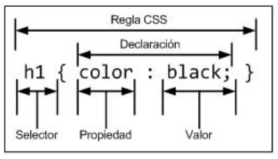
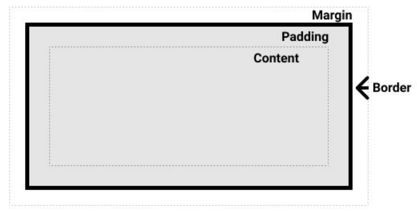
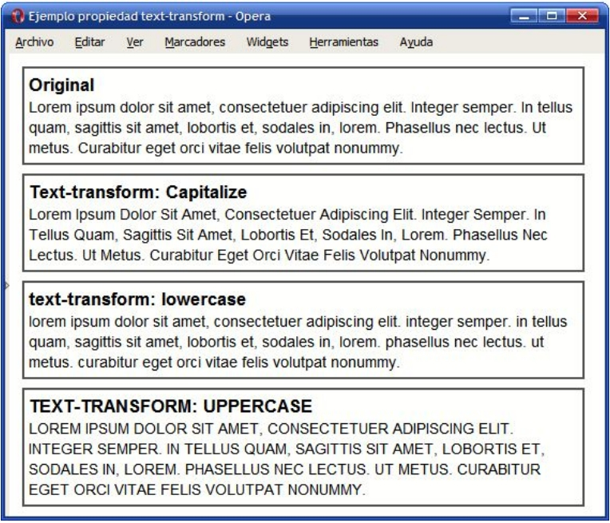
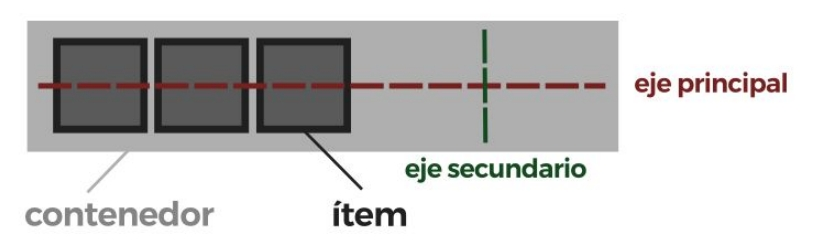

# CSS
CSS (Cascading Style Sheets) es un lenguaje para controlar el aspecto o presentación de los elementos HTML. Es un archivo de texto con extensión `.css` y se pueden crear tantos como sean necesarios y cada página HTML puede enlazar tantos archivos CSS como necesite. [Lista completa de referencias](https://www.w3schools.com/cssref/index.php)

- [CSS](#css)
  - [Estructura básica](#estructura-básica)
  - [Trabajar en forma "INLINE"](#trabajar-en-forma-inline)
  - [Enlazar archivos CSS a página HTML](#enlazar-archivos-css-a-página-html)
  - [Selectores](#selectores)
    - [Algunas combinaciones de selectores](#algunas-combinaciones-de-selectores)
    - [Pseudo clases](#pseudo-clases)
      - [Pseudo elementos](#pseudo-elementos)
  - [Prioridades](#prioridades)
  - [Herencia](#herencia)
  - [Display](#display)
  - [Modelo de cajas](#modelo-de-cajas)
  - [Propiedad position](#propiedad-position)
  - [Propiedades de texto](#propiedades-de-texto)
    - [Fuentes](#fuentes)
  - [Propiedades color y background](#propiedades-color-y-background)
- [Flexbox](#flexbox)
  - [Alineación COMPLETAR](#alineación-completar)

## Estructura básica

La estructura básica del código CSS está compuesta por:
- Regla: Cada uno de los estilos que componen una hoja de estilos CSS. Comienza con un selector y entre llaves, una declaración.
- Selector: Indica el elemento o los elementos a los que se aplica la regla CSS. **"A quién hay que hacérselo"**.
- Declaración: Especifica los estilos que se aplican, es decir la/s propiedades. **"Qué hay que hacer"**.
- Propiedad: La característica que se modifica.
- Valor: El nuevo valor que toma esa característica.

## Trabajar en forma "INLINE"
Básicamente consiste en poner el código CSS dentro del código HTML usando el atributo `style` o la etiqueta `<style>` (la diferencia es que al usar la etiqueta estamos colocando código en CSS) además de ser el código con mayor prioridad. Entre cada declaración se coloca un ; para separarlas. Por ejemplo:
```HTML
<h1 style="color: blue;">Este es un Título azul</h1> <!-- Se podría haber usado:"color:rgb(0,0,255);" (rojo, verde, azul)-->
<h2 style="color: red; background-color: rgba(255,255,255,0.5);">Subtítulo</h2>
<!--En este caso el 4 componente (0.5) indica la opacidad del color y va desde 0 a 1-->
```
```HTML
<style>
    body {
        font-family: Arial, sans-serif;
    }
    h1 {
        color: blue;
    }
    h2 {
        color: red;
        background-color: rgba(255, 255, 255, 0.5);
    }
</style>
```

## Enlazar archivos CSS a página HTML
Se coloca en el head (no es necesario que este ahi, pero semanticamente debería estar ahi) la siguiente etiqueta:
```HTML
<link rel="stylesheet" type="text/css" href="path-archivo"/>
```
- rel: Indica el tipo de relación, que en este caso siempre es `"stylesheet"`
- type: Indica el tipo de recurso, que para CSS siempre es `"text/css"`
- href: La URL del archivo

## Selectores
Hay tres tipos de selectores (ordenados por especifidad):
- Selector por ID: Selecciona un elemento con el ID dado (debería ser solo uno) y se usa un `#`. `#ID{código}`
- Selector por Clase: Selecciona los elementos de una clase y se usa un `.`. `.clase1.clase2.clase3{código}`
- Selector por etiqueta: Selecciona una etiqueta como por ejemplo `h1`. `etiqueta{código}`
- Selector universal: Slecciona todos los elementos y se usa un `*`. `*{código}`.
Se pueden **combinar** es decir que puedo aplicar lo mismo a diversas etiquetas, clases o ID. Ejemplo: 
```css
h1, p, #pepe, .caja {
    color: red;
}
```
En este caso esto diciendo que `h1`, `p`, `#pepe`, `.caja` son de color rojo.

### Algunas combinaciones de selectores
Se pueden combinar los selectores, algunos ejemplos:
- Selectores descendentes: Selecciona aquellos hijos de otra etiqueta/clase/ID (no necesariamente tienen que ser hijos directos). Ejemplo: `article h3 {}` estaria seleccionando a los `h3` que sean hijos de un `article`. Otro ejemplo: `.cuadrado p {}` estoy seleccionando a los `p` hijos de la clase `cuadrado`.
- Selectores por hijos: Es lo mismo que el descendente pero en este caso solo aplica a los hijos directos y **se agrega** un `>`. Ejemplo: `section > p {}`
- Selectores adyacentes: En este caso estamos seleccionando elementos que esten pegados a otro elemento y **se agrega** un `+`. Siempre se selecciona el elemento de la derecha. Ejemplo: `h3 + p {}` estoy seleccionando todos los `p` que esten al lado de un `h3`.
- Selector por atributos: Puedo seleccionar elementos que tengan un atributo específico y **se usa** `[]`. Ejemplo: `[href] {}`, en este caso estoy sleccionando a todos los elementos que tengan el atributo `href`.
  - Puedo seleccionar aquellos con un valor en específico `[attr=valor]`. Ejemplo: `[href = "pepe.com"] {}`
  - Puedo seleccionar aquellos que empiecen con un valor `[attr^=valor]`. Ejemplo: `[href ^= "pepe"] {}`
  - Puedo seleccionar aquellos que terminen con un valor `[attr$=valor]`. Ejemplo: `[href $= ".com"] {}`

### Pseudo clases
Son varias pero sirven para ser mas específico al momento de seleccionar un elemento y se usa `:`. [Lista completa](https://developer.mozilla.org/es/docs/Web/CSS/Pseudo-classes). Ejemplo:
```css
ul > li:first-child{color: red;}
```
Lo que estoy seleccionando en este caso es el primer item de una lista desordenada. Si colacara `ul:first-child` esto solo se aplicaria a la primer lista desordenada que encuentre. Otro ejemplo:
```css
ul > li:nth-child(2n) {color: white;}
```
En este caso estoy pintando de blanco todos los elementos pares.
La pseudo clase que **mas vamos a usar** es `hover` que sirve para cuando pasamos por arriba con el mouse de ese elemento. Ejemplo:
```css
div.opcion-servicio.fondo-blanco:hover {
    color: rgba(179, 179, 179)
}
```
En este caso lo que estoy haciendo es que cuando a un `div` con las clases `opcion-servicio` y `fondo-blanco` le pase por arriba con el mouse el color pase a ser gris.

#### Pseudo elementos
Las que mas vamos a usar `after` y `before` con un `::` y estos sirven para añadir contenido (otros permiten seleccionar partes de un elemento) elegir cierta parte de un elemento. [Lista completa](https://developer.mozilla.org/es/docs/Web/CSS/Pseudo-elements)
```css
h1::before { content: "Capítulo - "; } /* añade contenido antes del elemento */
p::after { content: "."; } /* añade contenido después del elemento */
::first-letter { ... } /* para darle estilos a la primer letra */
::first-line { ... } /* para darle estilos a la primera línea de texto */
```

## Prioridades
En caso de que tengamos distintas reglas para un mismo elemento, CSS tiene una prioridad basada en dos conceptos:
- Especifidad: Cuanto más específica sea una regla mayor prioridad tiene. Ejemplo: Es más prioritario el selector por ID que el universal.
- Cascada: Cuanto más abajo este el código mas importancia va a tener. Aplica tanto para el propio código en el archivo CSS como en el orden en el que linkeamos los archivos CSS en código HTML.

## Herencia
ALgunas propiedades se pueden heradad como la fuente o el tamaño de letra. Ejemplo:
```HTML
<div class="text-container">
    <span>Un texto</span>
    <span>Otro texto</span>
    <a>Un link</a>
</div>
```
```css
.text-conteiner{
    font-size: 48px;
}
```
En este ejemplo todas las etiquetas `<span>` y la etiqueta `<a>` heredan el tamaño de letra del `<div>`

## Display
Algunos elementos tienen un estilo por defecto al ser mostrados, pero que puede ser modificado usando `display`. Por ejemplo los `div` son elementos `block` los cuales no permiten tener elementos al costado. Los que más vamos a usar son:
- `inline`: En este caso hacemos que el elemento se adapte al tamaño del contenido y permiten poner contenido al costado. Lo malo es que no podemos determinar el tamaño.
- `block`: En este caso los block podemos ajustar el tamaño que queramos pero no podemos ubicar elementos al costado.
- `none`: En este caso hacemos que no se muestre, pero no deja de estar ahi solo lo ocultamos.

## Modelo de cajas
Todo los elementos de HTML para css son un caja, que esta conformada de la siguiente forma:
 Agregar
- El **margin** separa el contenido del exterior.
- El **border** Separa el margen del padding. Se puede personalizar (tamaño, tipo, color, etc).
- El **padding** Separa el contenido del borde.
```css
.modeloCaja {
    border: 1px, solid, black;
    padding: 50px; /*Es lo mismo en todos los lados*/
    padding: 25px, 75px; /*arriba/abajo    izquierda/derecha*/
    padding: 50px, 75px, 100px, 125px; /*arriba derecha abajo izquierda*/
    padding-bottom: 150px; /*Puedo trabajar con cada uno por separado*/
    margin: 50px; /*Los ejemplos son los mismos que los de padding*/
}
```

## Propiedad position
Sirve para posicionar un elemento en la página web.Existen cinco tipos:
- `static`: Es la posición por defecto de todos los elementos.
- `relative`: En este caso podemos darle valores para moverlo (top, right, bottom y right) ***respecto a la posición orginal***. Para el resto de elementos sigue estando en el mismo lugar, provocando solapamientos.
  - Propiedad `z-index`: viene a representar el eje Z para determinar como se solapan los elementos.
- `absolute`: No ocupa espacio "físico" solapandose con el resto de elementos. Si le definimos valores se posiciona de forma absoluta respecto al body.
- `fixed`: Se queda quieto respecto a la visualización "persiguiendonos".
- `sticky`: Funciona como un relative mientras no lo pasemos, pero al pasarlo scrolleando funciona como un fixed.

## Propiedades de texto
Podemos personalizar los textos de varias maneras, estas son las más comunes:
- `font-size`: Tamaño de la fuente en px, em, o %.
- `font-weight`: Establece el peso, como la **negrita**. Valores: normal, bold o light.
- `font-style`: Para especificar si la fuente es *italica*. Valores: normal o italic.
- `text-decoration`: Establece la decoración del texto (subrayado o tachado). Valores: none, underline, lone-throught o overline.
- `text-transform`: Transforma el texto original a mayúsculas, minusculas, etc. Valores: none, capitalizate, uppercase o lowercase.
- `letter-spacing`: Permite establecer el interlineado. Valores: none, n°px o  inherits.


### Fuentes
Para poner alguna letra la recomendación es usar alguna que este en [Google Fonts](https://fonts.google.com/) para lo cual primero hay que importarla y después usar `font-family`.

## Propiedades color y background
Podemos personalizar el color y los fondos usando las siguientes propiedades:
- `color`: Establece el color del texto
- `background-color`: Establece el color del fondo. Se puede poner en transparent inclusive.
- `background-image`: Establecemos una imagen como fondo. Valor: url o none.
- `background-repeat`: Podemos hacer que esa imagen se repita de algunas formas. [Detalles](https://developer.mozilla.org/en-US/docs/Web/CSS/background-repeat)
- `background-attachment`: Podemos hacer que la imagen del fondo sea fija. [Detalles](https://developer.mozilla.org/es/docs/Web/CSS/background-attachment)
- `background-position`: Establece la posición de la imagen de fondo. Valores: valor | top | center | bottom | left | center | right

# Flexbox
Es un sistema de elementos flexibles que se carectirizan por su habilidad de alterar su ancho y alto para ajustarse lo mejor posible al espacio disponible en cualquier dispositivo. Vamos a posicionar **Contenedores "padre"** que contiene a los items, pero el contenedor es flex no los items que contiene. Usamos los valores `valores flex` o `inline-flex` en la propiedad `display`. Para que empezar hay determinar que un contenedor es flexible usando `display: flex;`.
- Eje principal: Los contenedores tendran una dirección principal específica. Por defecto es horizontal, en fila (row).
- Eje secundario: De la misma forma, los contenedores flexibles tendrán una orientación secundaria, perpendicular a la principal. Si la principal es en horizontal, la secundaria será en vertical, y viceversa.
Por defecto los contenedores flexibles **no** permiten el desbordamiento. `flex-wrap: nowrap;` esta activado por defecto, en cambio podemos usar `flex-wrap: wrap;` de esta forma los elemento se acomodan y permite que desborden lo que genera un diseño **responsive** (que se adapte a varias pantallas).


## Alineación COMPLETAR
Podemos alinear los elementos en la dirección principal y en la dirección secundaria. La propiedad que vamos a usar es: `justify-content:` (eje principal) y `align-items:` (eje secundario).
- `justify-content: center`: Los coloca en el centro.
- `justify-content: start`: Los comienza en el comienzo a la izquierda.
- `justify-content: space-around`: Coloca los elementos a una distancia X de cada uno, con una distancia X/2 del extremos **en el eje principal**.
- `justify-content: space-between`: Funciona similiar al `space-around` solo que no deja ese espacio de X/2.
- `justify-content: space-evenly`: Funciona de forma similar al `space-around` solo que TODAS las distancias son X.

Tambien podemos usar `gap:` para determinar la distancia entre cada elemento en ambas direcciones o puedo poner una distancia fija para cada eje usando: `row-gap:` y `column-gap:`