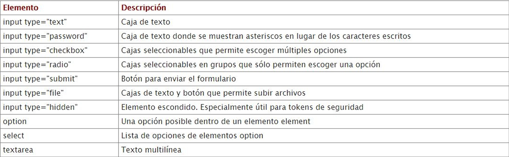

# HTML
HTML es un lenguaje de marcado de hipertexto. Es decir que es un lenguaje de marcas compuesto por un conjunto de elementos para darle estructura y semántica al contenido. En HTML 5 hay que usar las etiquetas/elementos que correspondan. Todo lo que tenga que ver con lo estético se usa CSS
El archivo principal se llama `index`.

- [HTML](#html)
  - [Etiquetas](#etiquetas)
  - [Atributos](#atributos)
  - [Estructura básica](#estructura-básica)
  - [Moverse por las carpetas](#moverse-por-las-carpetas)
  - [Formulario](#formulario)
  - [Métodos GET y POST](#métodos-get-y-post)
    - [GET](#get)
    - [POST](#post)

## Etiquetas
Estan compuestas por una etiqueta de apertura y etiquetas de cierre [Link completo](https://www.w3schools.com/tags/), en el link al seleccionar una etiqueta tambien muestra los **atributos** propios de esa etiqueta. Algunos comúnes:

- `<!DOCTYPE html>` — el tipo de documento. Es un preámbulo requerido. Anteriormente, cuando HTML era joven (cerca de 1991/2), los tipos de documento actuaban como vínculos a un conjunto de reglas que el código HTML de la página debía seguir para ser considerado bueno, lo que podía significar la verificación automática de errores y algunas otras cosas de utilidad. Sin embargo, hoy día es simplemente un artefacto antiguo que a nadie le importa, pero que debe ser incluido para que todo funcione correctamente.
- `<html></html>` — el elemento `<html>`. Este elemento encierra todo el contenido de la página entera y, a veces, se le conoce como el elemento raíz (root element).
- `<head></head>` — el elemento `<head>`. Este elemento actúa como un contenedor de todo aquello que quieres incluir en la página HTML que no es contenido visible por los visitantes de la página. Incluye cosas como palabras clave (keywords), una descripción de la página que quieres que aparezca en resultados de búsquedas, código CSS para dar estilo al contenido, declaraciones del juego de caracteres, etc.
- `<meta charset="utf-8"> — <meta>`. Este elemento establece el juego de caracteres que tu documento usará en utf-8, que incluye casi todos los caracteres de todos los idiomas humanos. Básicamente, puede manejar cualquier contenido de texto que puedas incluir. No hay razón para no establecerlo, y puede evitar problemas en el futuro.
- `<title></title>` — el elemento `<title>` establece el título de tu página, que es el título que aparece en la pestaña o en la barra de título del navegador cuando la página es cargada, y se usa para describir la página cuando es añadida a los marcadores o como favorita.
- `<body></body>` — el elemento `<body>`. Encierra todo el contenido que deseas mostrar a los usuarios web que visiten tu página, ya sea texto, imágenes, videos, juegos, pistas de audio reproducibles, y demás.
  
## Atributos
Van en la etiqueta de apertura y sirven para cambian la funcionalidad de las etiquetas. [Atributos globales](https://www.w3schools.com/tags/ref_standardattributes.asp).
Los mas comunes son `id` y `class`. Ejemplo:
```html
<a id="vinculo" href="https://www.w3schools.com/tags/tag_a.asp">Esto es un hipervinculo"</a>
<p class="grupo">Esto es un párrafo</p>
<h6 class="grupo fondoNegro">Esto es un H6</h6> <!--Se puede tener mas de una clase-->
```

## Estructura básica
Todos los arichivos `html` arrancan con una estructura que es la siguiente: (protip poner `!` al comienzo del archivo)
```html
<!DOCTYPE html>
<html lang = "ES">  <!--Define el idioma del documento-->
    <head>          <!--Todo el contenido NO visible o información para el navegador-->
        <meta charset="utf-8"/> <!--Esto sirve para indicarle al navegador que caracteres se van a utilizar-->
    </head> 
    <body>  <!--Aca va todo el contenido visible-->
        <header></header>
        <main></main>       <!--Es es más opcional pero en general sigue esta estructura-->
        <footer></footer>
    </body>   
</html>
```

## Moverse por las carpetas
Si quisiera cargar un recurso que este en la carpeta (o en otra) por ejemplo una imagen puedo usar lo siguiente:
- `./`: Significa el mismo path en el que esta el programa y puedo moverme al resto de carpetas.
- `../`: Sirve para "subir" de la carpeta en la que este.

## Formulario
Va a ser la forma de recibir información por parte del usuario. Procesar esa información va a ser trabajo del backend en nuestro caso **PHP**. [Algunos templates](https://freefrontend.com/css-forms/). 
Un ejemplo de un formulario en HTML:

```html
<form action="/submit-form" method="post">
    <label for="fname">First name:</label>
    <input type="text" id="fname" name="fname"><br><br>
    <label for="lname">Last name:</label>
    <input type="text" id="lname" name="lname"><br><br>
    <input type="submit" value="Submit">
</form>
```

- `<form>`: Este elemento crea un formulario para la entrada del usuario. El atributo `action` especifica a dónde se enviarán los datos del formulario cuando se envíen, y el atributo `method` especifica el método HTTP que se usará (en este caso, `post`).
- `<label>`: Este elemento etiqueta los campos del formulario. El atributo `for` debe coincidir con el `id` del campo de entrada correspondiente.
- `<input>`: Este elemento crea un campo de entrada donde el usuario puede ingresar datos. El atributo `type` especifica el tipo de entrada (en este caso, `text`), `id` proporciona un identificador único para el campo, y `name` es el nombre del campo que se enviará con los datos del formulario.
- `<input type="submit">`: Este elemento crea un botón de envío que envía los datos del formulario al servidor especificado en el atributo `action` del formulario.

Este formulario simple solicita al usuario su nombre y apellido y luego envía esos datos al servidor cuando se hace clic en el botón "Submit".



## Métodos GET y POST
Sirven para poder enviar información del front al back y de esa forma procesarla para hacer algo.

### GET
En este caso la información se envía directamente por medio de la url y **la información esta separada por un ?**. Un ejemplo: `www.algo.com/index.html?key1=value1?key2=value2...`

- Al enviar la información por la url se limitada a 2000 caracteres.
- La información es visible por lo que **nunca se manda información sensible**.
- **No se puede enviar datos binarios** (archivos, fotos).
- En PHP los datos se administran con el **array asociativo $_GET**.

### POST
En este caso la información se codifica y se envía a través del **body del HTTP Request**, por lo que no aparece en la url.

- No cuenta con límite de cantidad de información.
- Como la información no es visible, se puede envir información sensible.
- Se puede enviar datos binarios.
- En PHP los datos se administran con el **array asociativo $_POST**.