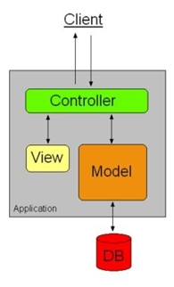

# Curso-desarrollo-web-Full-Stack
... y algunos conceptos importantes:

## Modelo de capas MVC
Es una propuesta de arquitectura de software utilizada para separar el código por sus distintas responsabilidades, manteniendo capas muy distintas que se encargan de una tarea muy concreta. En este caso las tres capas del modelo MVC son: Modelos, Vistas y Controladores.

    
    

## Bootstrap
Es un framework de CSS, que nos da herramientas para que creemos página web siguiendo la estrategia mobile first. [Página de Bootstrap](https://getbootstrap.com/), tiene distintas plantillas para poder utilizar. Básicamente distribuye la página en 12 rejillas las cuales muestran el contenido de forma flexible.

En general lo que se suele hacer es copiar y pegar el código de estas plantillas, seria la ""mala manera de hacerlo"". Lo que debería hacerse es utilizar las herramientas (que suelen ser clases) y crear mi propio contenido. Para poder utilizarlo hay que vincular en nuestro HTML el archivo CSS y el de Javascript. Hay que tener cuidado ya que al inlcluir el css, puede provocar cambios en nuestra página ya que agrega estilos por defecto.
